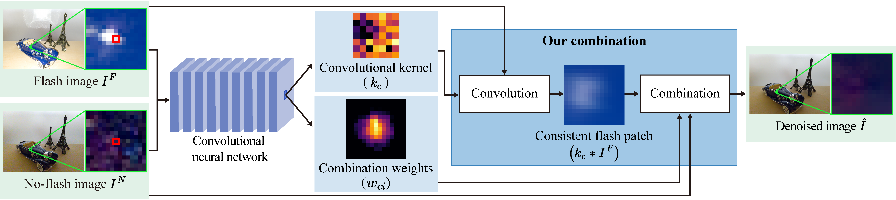

# [Robust Image Denoising of No-Flash Images Guided by Consistent Flash Images (RIDFnF)](https://cglab.gist.ac.kr/aaai23ridfnf/)

[Geunwoo Oh](https://greeny53.notion.site/Geunwoo-Oh-f110abf14321482d9dbc435982faa5ef), [Jonghee Back](https://jongheeback.notion.site/Jonghee-Back-c553120bca4144189bd9416d2fcfb0c1), [Jae-Pil Heo](https://sites.google.com/site/jaepilheo/), [Bochang Moon](https://cglab.gist.ac.kr/people/bochang.html)
 


An official source code of AAAI 2023 paper, "Robust Image Denoising of No-Flash Images Guided by Consistent Flash Images".
For more information, please refer to our project page or other resources below:
* [project page](https://cglab.gist.ac.kr/aaai23ridfnf/)
* [paper](https://drive.google.com/file/d/1-5CLiNzyxa7KzJIWeFXX22CTV7p9hYDE/view?usp=sharing)
* [supplementary report](https://drive.google.com/file/d/1XG50PeBjvOiRGU_5C7gwS7VmUOqE-yQc/view?usp=share_link)

<hr />

> **Abstract** *Images taken in low light conditions typically contain distracting noise, and eliminating such noise is a crucial computer vision problem. Additional photos captured with a camera flash can guide an image denoiser to preserve edges since the flash images often contain fine details with reduced noise. Nonetheless, a denoiser can be misled by inconsistent flash images, which have image structures (e.g., edges) that do not exist in no-flash images. Unfortunately, this disparity frequently occurs as the flash/no-flash pairs are taken in different light conditions. We propose a learning-based technique that robustly fuses the image pairs while considering their inconsistency. Our framework infers consistent flash image patches locally, which have similar image structures with the ground truth, and denoises no-flash images using the inferred ones via a combination model. We demonstrate that our technique can produce more robust results than state-of-the-art methods, given various flash/no-flash pairs with inconsistent image structures.*
<hr />

## Network Architecture



## Setup
### 1. Environments (tested)
- Unbuntu 20.04
- Tensorflow 2.6.0
- GPU: NVIDIA TITAN RTX 
  - driver version >= 470
### Requirements
Please install docker and nvidia-docker.
- Installation docker [[guide]](https://docs.docker.com/engine/install/ubuntu/)
- Installation nividia-docker [[guide]](https://docs.nvidia.com/datacenter/cloud-native/container-toolkit/install-guide.html#docker)
### 2. Building docker
1. On a terminal, access the directory located on `Dockerfile` and run a command to build a docker image:
    ```
    docker build -t rid_fnf .
    ```
2. After building a docker image, create a container:
    ```
    nvidia-docker run -v ${PWD}/data:/data -v ${PWD}/codes:/codes -it rid_fnf;
    ```
    Or, simply run `run_docker.sh`.
    ```
    ./run_docker.sh
    ```
## Test with a pre-trained network
1. Setup configurations in `config.py`.
    ```
    # Mode selection [TRAINING, TEST]
    config["mode"] = "TEST"
    config["loadEpoch"] = "50" # for testing with pre-traind parameter (training epoches : 50)
    
    # directory of training dataset
    config["trainDatasetDirectory"] = "../data/__train_scenes__"
    config["train_input"] = ['train_images'] 
    config["train_target"] = ['train_images']
    
    # noise levels of training/test
    config['noise_levels'] = ['25','50','75']
    
    # folder name for task (traing/test)
    config['task'] ='image_denoising_test_pretrained' # folder name containing pretrained parameters
    ```
2. Run a command on the terminal launched container (bash terminal for building docker, `2.2 of Setup`).
   - The result images will be saved in `/data/config['task']/output`.
    ```
    python main.py
    ```
## Test using real noise images with a pre-trained network 
1. Setup configurations in `config.py`.
    ```
    # Mode selection [TRAINING, TEST]
    config["mode"] = "TEST"
    config["loadEpoch"] = "50" # for testing with pre-traind parameter (training epoches : 50)
    
    # folder name for task (traing/test)
    config['task'] ='image_denoising_test_pretrained' # folder name containing pretrained parameters
    ```
2. Run a command on the terminal launched container (bash terminal for building docker, `2.2 of Setup`).
   - The result images will be saved in `/data/__real_test__/real_images/output`.
    ```
    python test_for_real.py
    ```
## Retraining
1. Prepare a dataset
    - We used the public dataset [[link]](http://yaksoy.github.io/faid/) for the paper. For example, `test_image_pairs.txt` and `val_image_pairs.txt` include the file names of the 256 test pairs and the file names of the 256 validation pairs used for our paper respectively. The other pairs were used for training our network.
    - For retraining our method with a new dataset, split it into a training and test set. Then, move the training set into the training folder (`/data/__train_scenes__/train_images`) and the test set into the test folder (`/data/__test_scenes__/test_images`).


2. Setup configurations in `config.py`.
    ```
    # Mode selection [TRAINING, TEST]
    config["mode"] = "TRAINING"
    
    # Training
    config['epochs'] = 50 # the max epoch for training
    
    # directory of training dataset
    config["trainDatasetDirectory"] = "../data/__train_scenes__"
    config["train_input"] = ['train_images'] 
    config["train_target"] = ['train_images']
    
    # noise levels of training/test
    config['noise_levels'] = ['25','50','75']
    
    # folder name for task (traing/test)
    config['task'] ='image_denoising_training' # folder name to contain training results
    ```
3. Run a command on the terminal (the bash terminal for building docker, `2.2 of Setup`).
   - After training, the result images will be saved in `/data/config['task']/output`.
    ```
    python main.py
    ```


## License

All source codes are released under a [BSD License](license).


## Contact

If you have any questions, issues, and comments, please feel free to contact [gnuo8325@gm.gist.ac.kr](mailto:gnuo8325@gm.gist.ac.kr).
